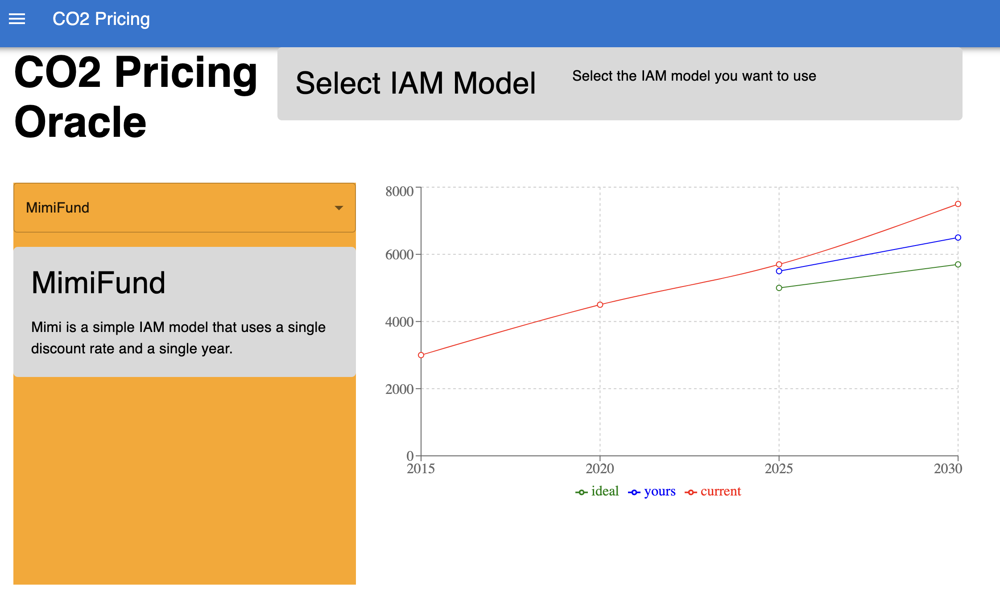

# CO2 Pricing

This repository contains components used to offer an open source CO2 pricing tool. The tool is based on the work of the [Climate Framework for Uncertainty, Negotiation and Distribution (FUND)](<https://github.com/fund-model/MimiFUND.jl>). It provides a simple way to estimate the impact of CO2 pricing on the economy and the environment. It also includes 2 other solutions in it:

* A [API Wrapper](/tree/main/julia) around the [Mimifund] service, providing its features in a simple way
* A [Web Application](/tree/main/app)
* A set of [Data Pipelines](/tree/main/pipelines)



## Built With

* Web App ([TypeScript](https://www.typescriptlang.org))
  * [Next.js](https://nextjs.org)
  * [Docker](https://docker.com)
* API Wrapper ([Julia](https://julialang.org))
  * [Genie](https://genieframework.com)
  * *[Mimi (Integrated Assessment Modeling Framework)](https://github.com/mimiframework/Mimi.jl)*
  * [Docker](https://docker.com)
* Data Pipelines (Typescript, [Python](https://www.python.org))
  * [AWS Lambda](https://aws.amazon.com/lambda)
  * [AWS S3](https://aws.amazon.com/s3)
  * [AWS Glue](https://aws.amazon.com/glue)
  * [AWS Athena](https://aws.amazon.com/athena)
  * ... other support services & to come!
* (Deployment)
  * [docker-compose (Local)](https://docs.docker.com/compose)
  * [AWS CDK (IaC)](https://github.com/aws/aws-cdk#getting-started)

## Getting Started

This repository is a monorepo, so you can run it in different ways,

## Developing with `docker-compose` (Recommended)

The easiest way is to use the docker-compose file provided in the root of the repository. It will build the web application and the API Wrapper, and run them in a docker container.

### Prerequisites

This is an example of how to list things you need to use the software and how to install them.

* [Docker](https://docker.com)
* docker-compose (should be installed with Docker)

### Installation

1. Clone the repo

   ```sh
   git clone https://github.com/Open-Earth-Foundation/co2-pricing.git
   ```

2. Copy the `app/.env.example` file to `app/.env` and fill the variables

   ```sh
   cp app/.env.example app/.env
   ```

3. Run the docker-compose file

   ```sh
    docker-compose up
    ```

<!-- ROADMAP -->
## Roadmap

See the [open issues](https://github.com/Open-Earth-Foundation/co2-pricing/issues) for a full list of proposed features (and known issues).

## Design Choices

* Event Driven Data pipeline sample : [Youtube (31s)](https://youtu.be/YQjuWiyeu-A?t=31)

<!-- LICENSE -->
## License

Distributed under the MIT License. See `LICENSE.txt` for more information.
